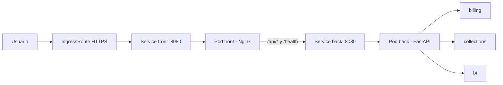

# ADR-002: Cliente-servidor en dos pods

- Estado: Aceptada
- Fecha: 2026-08-12
- Responsables: equipo SON-IA
- Reemplaza: ADR-001 para el despliegue

## Decisión

SON-IA conserva un backend modular único para los tres agentes y separa la
interfaz estática en otro contenedor. Kubernetes ejecutará exactamente dos pods
lógicos:

1. `front`: Nginx sirve la SPA y es el único punto público.
2. `back`: FastAPI expone `/api/*` y `/health`; no se publica directamente.

No se crea un microservicio por agente. Facturación, Cobranzas y BI son paquetes
internos de un mismo backend porque comparten contrato, despliegue y ciclo E2E.

## Contrato de red

El frontend recibe `BACKEND_HOST` y `BACKEND_PORT`; para K3S se debe configurar
`BACKEND_HOST=reto-movistar-back`. El backend mantiene `SONIA_PORT=8080`.

## Entrega operativa

El workflow publica dos imágenes multi-arquitectura con el mismo tag inmutable:
`reto-movistar-front` y `reto-movistar-back`. `K3S_Infra` despliega ambas
como Deployments independientes y conserva un único IngressRoute hacia el
frontend. El `Dockerfile` raíz queda únicamente como compatibilidad local.

## Consecuencias

- La UI y la API pueden desplegarse y escalarse por separado.
- El único origen público evita CORS y conserva el single point of entry.
- Los tres agentes comparten proceso Python; no hay saltos de red entre ellos.
- Se requieren dos Deployments, dos Services y un único IngressRoute.
- El dataset oficial permanece fuera de Git y de ambas imágenes.
