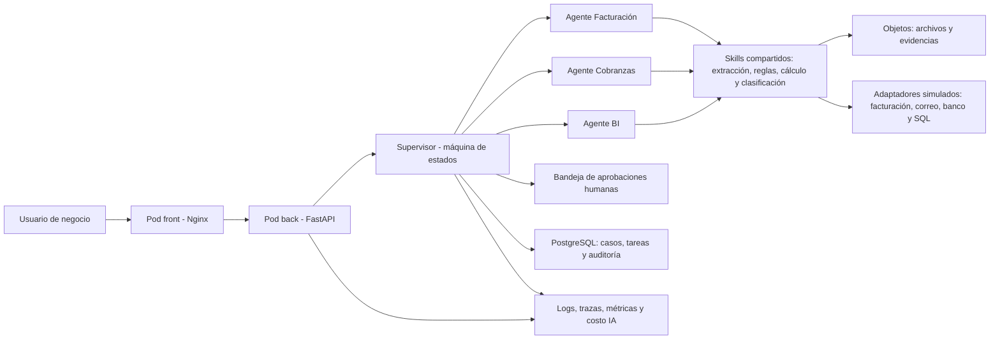

# Propuesta inicial de arquitectura y organización - SON-IA

SON-IA se implementa como una arquitectura **cliente-servidor de dos pods** con
un backend modular y orquestación agéntica controlada. La interfaz es el único
punto público; Facturación, Cobranzas y BI comparten la API y no se convierten
en microservicios independientes.

## 1. Decisión ejecutiva

| Tema | Decisión inicial |
|---|---|
| Alcance del MVP | Un caso E2E demostrable: validar PxQ, aprobar, simular emisión, identificar pago, conciliar y mostrar trazabilidad. |
| Arquitectura | SPA estática en Nginx y backend modular en Python/FastAPI, desplegados en dos pods. |
| Entrada pública | Un único host `reto-movistar.ikigais.app`, puerto interno `8080`. |
| Orquestación | Supervisor con máquina de estados explícita; el LLM propone, pero no decide transacciones irreversibles. |
| Agentes | Facturación, Cobranzas/Conciliación y BI, implementados como módulos internos del backend. |
| Intervención humana | Obligatoria antes de emitir una factura, aplicar un pago o aceptar una excepción material. |
| Datos | Solo datos ficticios o anonimizados durante el hackatón. |
| Integraciones | Adaptadores simulados detrás de interfaces para facturación, correo, banco y fuentes SQL. |
| Persistencia | PostgreSQL para casos, tareas, aprobaciones y auditoría; almacenamiento de objetos para documentos. |
| Predicción | Fuera del camino crítico inicial hasta disponer de volumen, calidad y ventana temporal suficientes. |

## 2. Qué debe demostrar el MVP

El reto describe un ecosistema amplio. Para entregar una solución creíble, el MVP debe concentrarse en una sola historia completa:

1. Un usuario carga un archivo ficticio con información PxQ.
2. El supervisor crea un caso y asigna la validación al agente de Facturación.
3. El agente extrae campos, aplica reglas y presenta evidencias y excepciones.
4. Una persona aprueba o rechaza el insumo desde la plataforma.
5. El sistema simula la emisión de la factura mediante un adaptador controlado.
6. El agente de Cobranzas clasifica un correo ficticio que informa un pago.
7. El agente de Cobranzas compara factura, depósito y cliente, y propone la conciliación.
8. Una persona confirma la aplicación del pago.
9. El agente de BI muestra el estado E2E, tiempos, excepciones y oportunidad de recupero.

Este recorrido cubre los tres momentos solicitados: asesoría previa, ejecución y rebaja post-pago.

## 3. Arquitectura propuesta



### 3.1 Entrada y experiencia de usuario

- Una SPA ligera presenta casos, tareas pendientes, aprobaciones, evidencias y KPIs.
- Nginx sirve la SPA y enruta `/api/*` y `GET /health` al backend.
- FastAPI se mantiene como servicio interno y registra los tres agentes.
- No se exponen directamente agentes, base de datos ni adaptadores.
- Cada pantalla debe mostrar qué hizo el sistema, con qué evidencia y qué decisión requiere una persona.

### 3.2 Supervisor

El supervisor no será un chat libre. Será una máquina de estados con transiciones permitidas:

`CREATED -> VALIDATING -> NEEDS_APPROVAL -> APPROVED -> EXECUTING -> ISSUED -> PAYMENT_DETECTED -> RECONCILING -> CLOSED`

Estados de excepción:

- `NEEDS_INFORMATION`
- `REJECTED`
- `EXECUTION_FAILED`
- `MANUAL_REVIEW`

El supervisor podrá seleccionar el siguiente agente y preparar una recomendación, pero no podrá saltarse una aprobación ni modificar estados financieros directamente.

### 3.3 Agentes y responsabilidades

| Agente | Responsabilidad | Salida estructurada |
|---|---|---|
| Facturación | Extraer PxQ, validar planta, tarifa, periodo y consistencia post-cálculo. | Campos, reglas aplicadas, evidencias, errores y nivel de confianza. |
| Cobranzas/Conciliación | Clasificar comunicaciones, priorizar cartera y comparar factura y pago. | Entidades, prioridad, coincidencias, diferencias y acción propuesta. |
| BI | Calcular KPIs, identificar quiebres y resumir oportunidades. | Métricas, alertas y explicación basada en datos registrados. |

Las capacidades de lectura de archivos, cálculo, búsqueda y validación se implementarán como **skills reutilizables**, no como agentes adicionales. Esto evita una red de agentes difícil de depurar.

### 3.4 Datos y auditoría

Entidades mínimas:

- `Case`: expediente E2E del cliente.
- `Document`: archivo recibido, hash, versión y procedencia.
- `Task`: trabajo asignado a un agente y su estado.
- `AgentRun`: modelo, prompt, latencia, tokens, costo y resultado estructurado.
- `Evidence`: página, celda, mensaje o registro que sustenta un dato.
- `Approval`: persona, decisión, comentario y fecha.
- `Invoice`: documento emitido o simulado.
- `Payment`: pago comunicado o detectado.
- `Reconciliation`: relación entre factura y pago.
- `AuditEvent`: evento inmutable de la línea de tiempo.

No se debe guardar razonamiento interno del modelo. Se guardan entradas permitidas, salida estructurada, evidencias, versión del prompt, decisión humana y transición de estado.

### 3.5 IA y reglas

- Usar salidas JSON validadas con esquemas tipados.
- Priorizar reglas deterministas para montos, fechas, tarifas y conciliación.
- Usar LLM para extracción, clasificación, resumen y explicación, no para aritmética final.
- Versionar prompts y datasets de evaluación.
- Exigir evidencia para cada campo crítico; una respuesta sin evidencia pasa a `MANUAL_REVIEW`.
- Mantener una interfaz de proveedor para cambiar el modelo sin modificar el dominio.

### 3.6 Analítica predictiva

La predicción no debe bloquear el MVP. Si luego existe histórico suficiente, el primer caso recomendable es estimar probabilidad o tiempo hasta el pago:

- Separación temporal entre entrenamiento y evaluación para evitar fuga de información.
- Modelo base interpretable antes de modelos complejos.
- Métricas: PR-AUC para eventos poco frecuentes, Brier Score y calibración para probabilidades; MAE o análisis de supervivencia para tiempo de pago.
- Comparación contra una regla base, por ejemplo antigüedad de deuda y comportamiento histórico.
- Ninguna predicción ejecutará cobros o bloqueos automáticamente.

## 4. Organización propuesta del repositorio

```text
reto-movistar/
├── README.md
├── docs/
│   ├── propuesta-arquitectura-sonia.md
│   ├── 00-inicio-rapido.md
│   ├── arquitectura/
│   │   └── decisiones/
│   └── runbooks/
├── business/
│   ├── 01-facturacion/
│   │   ├── README.md
│   │   ├── proceso.md
│   │   ├── reglas.yaml
│   │   └── casos.csv
│   ├── 02-cobranzas-recaudo/
│   │   ├── README.md
│   │   ├── proceso.md
│   │   ├── reglas.yaml
│   │   └── casos.csv
│   └── 03-demo-calidad/
│       ├── README.md
│       ├── guion-demo.md
│       ├── criterios-aceptacion.yaml
│       └── checklist-evidencias.md
├── data/
│   ├── README.md
│   ├── schemas/
│   └── synthetic/
│       ├── billing/
│       ├── collections/
│       └── payments/
├── prompts/
│   ├── supervisor/
│   ├── billing/
│   ├── collections/
│   ├── reconciliation/
│   └── bi/
├── evals/
│   ├── datasets/
│   ├── expected/
│   ├── rubrics/
│   └── reports/
├── front/
│   ├── agents/
│   │   ├── billing/
│   │   ├── collections/
│   │   └── bi/
│   ├── assets/
│   └── Dockerfile
├── back/
│   ├── src/sonia/
│   │   ├── agents/
│   │   │   ├── billing/
│   │   │   ├── collections/
│   │   │   └── bi/
│   │   ├── application/
│   │   ├── domain/
│   │   └── entrypoints/
│   ├── tests/
│   ├── Dockerfile
│   └── pyproject.toml
├── scripts/
├── Dockerfile
├── compose.yaml
└── .github/
    ├── CODEOWNERS
    ├── pull_request_template.md
    └── workflows/
```

## 5. Cómo trabajará el equipo

El equipo recomendado tiene un responsable técnico y tres responsables funcionales. Las personas no técnicas trabajan con archivos legibles y no necesitan modificar Python o Kubernetes.

| Rol | Propiedad principal | Puede editar directamente |
|---|---|---|
| Responsable técnico | Arquitectura, API, agentes, seguridad, CI/CD e integración. | `back/`, `front/`, `.github/`, `Dockerfile`, `compose.yaml`. |
| Persona 1 - Facturación | Proceso PxQ, reglas, excepciones y criterios de aprobación. | `business/01-facturacion/`, casos sintéticos relacionados. |
| Persona 2 - Cobranzas/Recaudo | Mensajes, pagos, conciliaciones, quiebres y prioridades. | `business/02-cobranzas-recaudo/`, casos sintéticos relacionados. |
| Persona 3 - Demo/Calidad | Journey, UX, criterios de aceptación, evidencias y pitch. | `business/03-demo-calidad/`, `evals/rubrics/`, documentación. |

### Flujo simple para colaboradores no técnicos

1. Copiar una plantilla existente de regla o caso.
2. Editar Markdown, YAML o CSV desde GitHub o un editor simple.
3. Abrir un PR usando la plantilla.
4. El responsable técnico revisa consistencia, datos sensibles e impacto.
5. CI valida formato y estructura.
6. El cambio se incorpora a los tests o evaluaciones automatizadas.

### Límites de seguridad y ownership

- `CODEOWNERS` exigirá revisión técnica para `back/`, `front/`, `.github/`, Dockerfiles e infraestructura.
- Ningún secreto se almacena en el repositorio.
- `data/synthetic/` no puede contener nombres, correos, teléfonos, cuentas o identificadores reales.
- Los prompts se revisan como código y deben tener versión y casos de evaluación.
- Toda regla de negocio debe incluir al menos un caso válido, uno inválido y el resultado esperado.

## 6. Contratos para archivos no técnicos

### Ejemplo de regla

```yaml
id: BILLING-001
name: El monto PxQ coincide con el total facturable
owner: facturacion
severity: blocker
inputs:
  - quantity
  - unit_price
  - invoice_total
condition: quantity * unit_price == invoice_total
on_failure: MANUAL_REVIEW
evidence_required:
  - source_file
  - source_location
```

### Ejemplo de criterio de aceptación

```yaml
id: E2E-001
given: existe un PxQ válido y un cliente ficticio
when: el usuario aprueba la emisión
then:
  - se crea una factura simulada
  - se registra quién aprobó y cuándo
  - el caso cambia a ISSUED
  - la línea de auditoría conserva la evidencia
```

## 7. Calidad, observabilidad y métricas

### Métricas técnicas

- Porcentaje de ejecuciones E2E completadas.
- Exactitud por campo y por tipo de documento.
- F1 de clasificación de mensajes de cobranza.
- Tasa de conciliación correcta y tasa de revisión manual.
- Latencia p50/p95 por agente y por skill.
- Tokens y costo por caso.
- Errores, reintentos y transiciones inválidas.

### Métricas de negocio

- Tiempo desde recepción del PxQ hasta disponibilidad de la factura.
- Errores detectados antes de emisión.
- Notas de crédito evitadas en casos simulados.
- Ratio cobrado/facturado a 30 días.
- Tiempo de identificación de depósitos.
- Tiempo de conciliación y porcentaje de partidas no identificadas.

## 8. Entregas recomendadas

### Entrega 1 - Fundaciones y caso feliz

- Modelo de dominio y máquina de estados.
- Datos sintéticos y reglas de Facturación.
- Carga de PxQ, validación, evidencia y aprobación.
- Auditoría y UI mínima.

### Entrega 2 - Cobranza y recaudo

- Clasificación de correos ficticios.
- Detección de intención y datos de pago.
- Conciliación propuesta y aprobación humana.
- Métricas operativas.

### Entrega 3 - Historia integrada y robustez

- Journey E2E completo.
- Agente BI y tablero.
- Evaluaciones, manejo de excepciones y observabilidad.
- Demo repetible, documentación y despliegue.

## 9. Fuera de alcance inicial

- Emisión real de comprobantes.
- Aplicación real de pagos o movimientos bancarios.
- Conexión directa a sistemas internos de Movistar.
- Procesamiento de datos personales o estratégicos reales.
- Microservicios o pods independientes por agente.
- Entrenamiento de modelos predictivos sin dataset temporal validado.
- Autonomía sin aprobación para acciones financieras.

## 10. Decisiones que debemos confirmar

1. Formato exacto del PxQ y campos mínimos disponibles para la demo.
2. Si el jurado espera priorizar Facturación o mostrar el ciclo completo.
3. Proveedor de LLM permitido y restricciones de envío de datos.
4. Si PostgreSQL y almacenamiento de objetos estarán dentro o fuera del clúster.
5. Tecnología del frontend y nivel de fidelidad esperado.
6. Qué integración debe simularse y cuál debe quedar solo como contrato.

## Próximo paso

Validar esta propuesta con el equipo y convertir la Entrega 1 en backlog: historias, criterios de aceptación, dataset sintético y contratos de API. Solo después conviene crear el scaffold de código.
